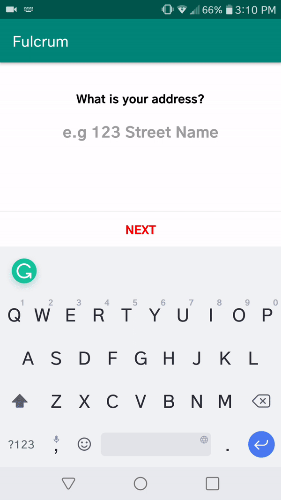

# Fulcrum

This is a simple two page application that is built to showcase Google Map address API. The first page of the application would prompt you to search your address. Based on the address provided by the user the application would hit the Google Map address API and return a suggestion list to the user. The second page would prompt you to search for a insurance carrier. The JSON data for the insurance carrier is stored in the res directory of the project. 

## Library
The following set of libraries are used in this project

- [x] RxJava
- [x] Retrofit
- [x] Dagger 2
- [x] GSON

## Design Pattern
 Model View ViewModel (MVVM)

## Navigation Architecture Component
Jetpack Navigation

## Application Workflow Video

## Download
<strong>
<a href="https://github.com/spkdroid/Fulcrum/blob/master/app-debug.apk">Download Now!!</a>
</strong>

## Authors

* **Ramkumar Velmurugan** - <a href="http://www.spkdroid.com/CV/">Portfolio</a>

